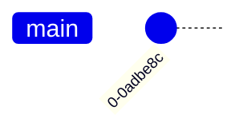
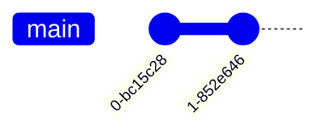
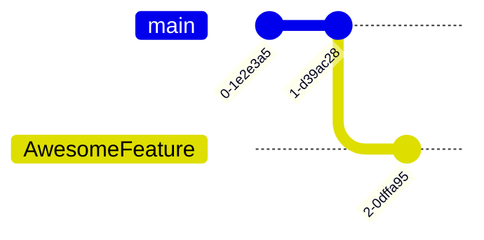
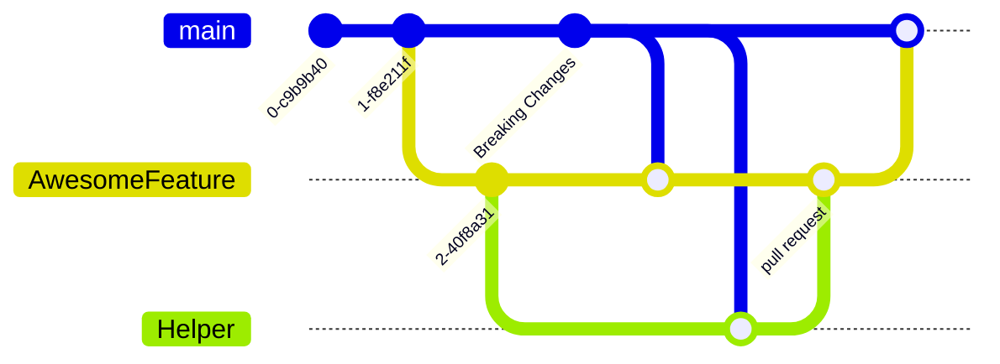

# Welcome to __Incomplete Infinity__ GitHub Repository

### Introduction To GitHub

Embark on a comprehensive, visually enriched journey through __Incomplete Infinity__ GitHub Repository, where the symphony of code unfolds in a celestial rhythm.

#### 1. Visual Overview

Behold the expansive git graph, a celestial roadmap mapping commits in the vast 'main' branch. Each commit, akin to a star in our coding constellation, bears a unique tag.



As developers 'push' code, new stars emerge, coalescing into a constellation of progress.



The 'main' branch, a sanctuary safeguarded for security, beckons contributions through 'forks' and 'branches.'


'Checkout' your branch, carving your distinct niche in the expansive GitHub galaxy.



Commit freely to your branch, weaving an intricate tale of code adventures.


Conclude your coding saga with a 'pull request,' extending an invitation to collaborators.


Encounter conflicts as stars align, harmoniously resolved through the 'merge' ritual.


Fear not! Each feature claims its cosmic space, coexisting harmoniously.



In cosmic collaborations, helpers forge new galaxies, merging seamlessly.

Unveil the powers GitHub bestows upon you:

1. `Clone`: Download the essence of a project.
  - Makes your very own copy of a project
2. `Branch`: Create alternate dimensions for experiments.
  - 
3. `Push`: Upload your cosmic creations.
4. `Pull Request`: Seek approval to merge into the main universe.

### 3. Clone a Repository

Embark on your coding odyssey by cloning a repository:

```bash
git clone https://github.com/organization/repository.git
```

A local copy for your coding experiments!

### 4. Create a Branch

Forge new dimensions for coding adventures:

```bash
git checkout -b your-feature-branch
```

Isolate features without disturbing the coding cosmos.

### 5. Make Changes and Commit

Craft your coding tale:

```bash
git add .
git commit -m "Fix issue #123: Add feature XYZ"
```

Clear commit messages guide others through your coding journey.

### 6. Push Changes to GitHub

Broadcast your coding tale:

```bash
git push origin your-feature-branch
```

Make your contributions visible across the GitHub galaxy.

### 7. Create a Pull Request

Initiate discussions with cosmic peers:

Create a pull request for your changes on GitHub.

### 8. Review and Merge

Engage in cosmic collaboration:

Wait for review, make adjustments, and once approved, merge your changes.

Reviews ensure code quality before merging into the cosmic main branch.

#### 9. Checking a Repo for Deployment

Navigate the GitHub stars:

##### Deployments Tab

1. Open the repository on GitHub.
2. Visit the "Deployments" tab.

Crucial for ensuring successful cosmic deployments.

##### Deployment Status

Read the cosmic signs:

Review the status and logs for a harmonious deployment.

Understanding deployment status ensures a smooth cosmic journey.

#### 10. Additional Resources

Embark on a deeper exploration of the GitHub galaxy:

- [GitHub Docs](https://docs.github.com/en): A knowledge hub for mastering the GitHub universe.
- [GitHub Learning Lab](https://lab.github.com/): An interactive playground for honing coding skills.
- [GitHub CLI Guide](https://cli.github.com/manual/): Navigate GitHub via the command line.

#### Expanded Visual Overview

Dive deeper into the cosmic tapestry of our GitHub journey with an expanded visual exploration:


This expanded graph provides a nuanced view of the cosmic dance from cloning to deployment, ensuring a seamless journey through the GitHub galaxy.

#### GitHub Commands

Explore a cosmic array of GitHub commands to navigate the GitHub galaxy with finesse:

```bash
# Clone a Repository
git clone https://github.com/organization/repository.git

# Create a Branch
git checkout -b your-feature-branch

# Make Changes and Commit
git add .
git commit -m "Fix issue #123: Add feature XYZ"

# Push Changes to GitHub
git push origin your-feature-branch

# Create a Pull Request
# Initiate discussions with cosmic peers
# Create a pull request for your changes on GitHub

# Review and Merge
# Engage in cosmic collaboration
# Wait for review, make adjustments, and once approved, merge your changes
```

These commands serve as a stellar guide for traversing the GitHub universe with precision.

Feel free to reach out for any questions or cosmic assistance! Happy coding, intrepid explorer! 🚀🌌
